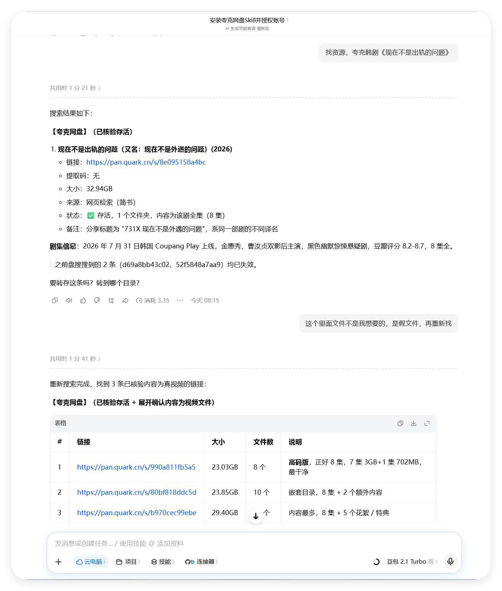

# 果汁搜盘 juicePans

> 纯 Python 标准库的多引擎网盘资源聚合搜索工具 / 通用skill —— 多源并行检索、链接存活核验、四级状态机、零第三方依赖。

---

## 这是什么

**果汁搜盘（juicePans）** 是一个聚合网盘资源搜索工具：给定一个片名或资料关键词，它同时向多个公开搜索源发起检索，将结果按网盘类型分组、去重、排序后输出可点击的分享链接，并在交付前对链接做**真实存活核验**。

它本身**不索引、不托管、不转存任何文件**，只是把多个公开检索源的结果整理好端到你面前。

### 效果示例




### 核心特性

- **多引擎并行**：内置盘搜（pansou）、海搜（haisou）、小云（yunso）、盘小子（panxiaozi）、TG 聚合库（ghspider）五个公开引擎，外加可选的自建 PanSou（local），通过线程池并行请求、按固定顺序合并去重；
- **综合排序**：去重后按「关键词匹配度 > 引擎来源等级 > 时间新鲜度」组内排序，最佳匹配排最前；
- **引擎熔断**：某引擎连续失败 2 次自动冷却 30 分钟，不拖慢整体检索（可用 `--fresh` 强制全跑）；
- **关键词变体兜底**：0 结果时自动用「去空格 / 全角转半角 / 去修饰词」变体再试一轮；
- **8 类网盘匿名核验**：内置夸克（CLI 实测 + 匿名接口兜底）、阿里云盘、115、123、天翼、百度、蓝奏、UC 的存活检测端点，**全部纯标准库实现，无需任何 cookie / token**；不支持 types（迅雷 / 移动 / PikPak 等）诚实标「未核验」，绝不假装核验；
- **四级链接状态机**：每次核验结果持久化到本地 JSON，状态分「有效 / 疑似失效 / 确认失效 / 未核验」四级——连续 2 次失败才判死（防误杀）、有效 72h 内不复检、失效 12h 后自动复查是否恢复；磁力 / 电驴链接永不误伤；
- **失效链沉底**：已确认失效的链接在搜索结果中自动沉底（仍展示、不删除，由你自己判断）；
- **限流退避**：对上游 API 的 429 / 403 按 Retry-After / 指数退避重试，内置频率纪律，不对同一站点高频连发；
- **零依赖**：仅 Python 标准库，无需 Docker、uv、requests，克隆即用。

## 安装方法

### 作为通用skill安装

无需手动复制目录：点击[**此处下载skill**](https://github.com/sxsxhhh/juicePans/releases/latest)获取最新压缩包，然后直接将压缩包拖拽到技能框上传，或在对话中安装技能（在本地或云电脑模式中输入「安装此skill」并附上压缩包），即可完成安装。

> **搭配转存（可选）**：本工具只搜不转存；如需保存资源，可搭配夸克网盘、百度网盘等官方 skill / 插件使用，将核验通过的分享链接一键转存到自己的网盘，并自动过滤链接内夹带的广告文件。

### 作为独立命令行工具

任意装有 Python 3.8+ 的环境直接使用：

```bash
git clone https://github.com/sxsxhhh/juicePans.git
cd juicePans

# 搜索示例
python scripts/search.py --kw "星际穿越"

# 指定网盘类型 + 过滤
python scripts/search.py --kw "流浪地球2" --cloud_types quark,aliyun --include 4K --exclude 预告,CAM

# 指定引擎
python scripts/search.py --kw "三体" --engine pansou,yunso

# 链接核验
python scripts/check_links.py --url "https://pan.quark.cn/s/xxxx"
python scripts/check_links.py --file links.txt --force
```

Windows 控制台建议先执行 `$env:PYTHONUTF8=1` 设置 UTF-8 编码。

## 使用说明

### search.py 参数

| 参数                        | 说明                                                                          |
| ------------------------- | --------------------------------------------------------------------------- |
| `--kw`                    | 必填，搜索关键词。海搜另支持 `"精确短语"` 与 `-排除词`                                            |
| `--cloud_types`           | 限定网盘类型，如 `quark,aliyun,baidu`                                               |
| `--include` / `--exclude` | 包含 / 排除关键词（逗号分隔）                                                            |
| `--engine`                | 默认 `pansou,haisou,yunso`；`panxiaozi` / `ghspider` / `movie` / `local` 需显式指定 |
| `--limit`                 | 每种网盘最多展示条数（默认 8）                                                            |
| `--pansou_timeout`        | 盘搜超时秒数（默认 45），急用可调小                                                         |
| `--fresh`                 | 忽略引擎熔断状态，强制全部引擎执行                                                           |
| `--no-variants`           | 关闭 0 结果时的关键词变体自动重试                                                          |
| `--json`                  | 输出机器可读 JSON（含各源耗时 `elapsed`）                                                |

### check_links.py 参数

| 参数           | 说明                                       |
| ------------ | ---------------------------------------- |
| `--url`      | 单条链接核验，可重复传入                             |
| `--file`     | 从文本文件批量核验（每行一条）                          |
| `--force`    | 忽略缓存策略，全部强制实测                            |
| `--no-state` | 本次不读写状态机文件                               |
| `--json`     | 机器可读输出（统一状态码 `code` + 检测耗时 `elapsed_ms`） |

### 环境变量（可选）

| 变量                               | 作用                                |
| -------------------------------- | --------------------------------- |
| `PANSOU_URL` / `NETDISK_API_URL` | 自建 PanSou 根地址（启用 `local` 引擎与链接检测） |
| `QUARK_SKILL_DIR` / `NODE_BIN`   | 夸克 CLI 核验所需；未配置时自动回退到匿名接口检测       |

## 引擎一览

| 引擎          | 默认 | 说明                                                                           |
| ----------- | -- | ---------------------------------------------------------------------------- |
| `pansou`    | ✅  | 公开盘搜聚合（20+ 插件源），GET 优先                                                       |
| `haisou`    | ✅  | 海搜 API v2；共享出口 IP 常被限流，单源失败自动降级                                              |
| `yunso`     | ✅  | 小云搜索 JSON 接口，直链带时间                                                           |
| `panxiaozi` | —  | 盘小子：搜索页 + 详情页直链提取                                                            |
| `ghspider`  | —  | TG 频道爬虫聚合库（仓库数据每 6 小时更新），仅百度 / 夸克                                            |
| `movie`     | —  | 影视库热门 / 榜单发现入口                                                               |
| `local`     | —  | 自建 PanSou（`docker run ghcr.io/fish2018/pansou:latest`，见 `scripts/deploy.sh`） |

## 项目结构

```text
juicePans/
├── SKILL.md                 # 通用skill描述文件
├── scripts/
│   ├── search.py            # 多引擎聚合搜索
│   ├── check_links.py       # 链接存活核验 + 四级状态机
│   └── deploy.sh            # 自建 PanSou Docker 部署脚本
└── references/              # 数据源清单、接口细节、合规红线等参考文档
```

## 定位与红线

- 本工具**只检索、核验、展示**第三方公开分享的链接，不托管、不转存、不生成分享；
- 检索到的内容版权归属原作者 / 版权方，工具作者与来源站点无关；
- 明确拒绝的检索请求：盗版软件 / 注册机 / 激活工具、恶意程序、违法违规内容。

## 版本历史

| 版本          | 要点                                     |
| ----------- | -------------------------------------- |
| 1.0–1.2     | 三引擎聚合（pansou / haisou / yunso），沙箱适配与精修 |
| 1.3.0       | 新增 `panxiaozi`、`ghspider` 引擎           |
| 1.4.0       | 移植四级链接状态机                              |
| 1.5.0       | 综合排序、引擎熔断、关键词变体兜底、域名表补全                |
| 1.6.0       | 8 类匿名核验、失效链沉底、限流退避、展示优化                |
| 1.6.1–1.6.2 | 各源耗时统计、`--pansou_timeout` 可调超时         |

## 致谢 / 参考项目

本项目的部分引擎与设计思路直接借鉴自以下优秀的开源项目，在此逐一致谢：

**已整合为引擎：**

- [towelong/panxiaozi](https://github.com/towelong/panxiaozi) —— 盘小子，`panxiaozi` 引擎的来源；
- [John-h-netdisk/netdisk-spider](https://github.com/John-h-netdisk/netdisk-spider) —— TG 频道聚合库，`ghspider` 引擎的来源。

**借鉴设计思路：**

- [fish2018/pansou](https://github.com/fish2018/pansou) —— 公开盘搜聚合上游（`local` 自建引擎），综合排序思路来源；
- [caixiaoq/DuPanSou-Archive](https://github.com/caixiaoq/DuPanSou-Archive)（supansou）—— 链接四级状态机的思路来源；
- [wu529778790/panhub.shenzjd.com](https://github.com/wu529778790/panhub.shenzjd.com)（PanHub）—— 引擎熔断、关键词变体、抓取重试思路来源；
- [huanyu-a/panseek](https://github.com/huanyu-a/panseek) —— 网盘域名表补全思路来源；
- [Maishan-Inc/Limitless-search](https://github.com/Maishan-Inc/Limitless-search) —— 榜单 / 搜索建议发现入口思路来源；
- [fish2018/NetDiskLinkValidator](https://github.com/fish2018/NetDiskLinkValidator) —— 8 类网盘匿名检测端点的参考实现；
- [owu/share-sniffer](https://github.com/owu/share-sniffer) —— 统一状态码 + 检测耗时输出契约的思路来源；
- [Cp0204/quark-auto-save](https://github.com/Cp0204/quark-auto-save) —— 失效链接沉底与频率风控纪律思路来源；
- [fancydirty/mediary-scout](https://github.com/fancydirty/mediary-scout) —— 「最佳匹配」展示维度思路来源；
- [OzoO0/cloud-auto-save-x](https://github.com/OzoO0/cloud-auto-save-x) —— 交付前失效候选自动换链思路来源；
- [odysseusmax/tg-index](https://github.com/odysseusmax/tg-index) —— 限流指数退避思路来源。

感谢上述项目的作者们将经验开源共享。

## 免责声明

1. 本项目仅供**学习、研究与个人技术交流**使用，请勿用于任何商业用途或违法违规用途；
2. 项目本身不存储、不传播任何资源文件，所有搜索结果均来自第三方公开站点，与本项目无关；
3. 请于下载后 **24 小时内删除**本项目及其产生的本地缓存数据；
4. 搜索结果中的内容版权归原作者 / 版权方所有，请支持正版；因使用本项目产生的任何法律后果由使用者自行承担；
5. 使用本项目即表示你已阅读并同意上述条款，如不同意请立即停止使用并删除。
